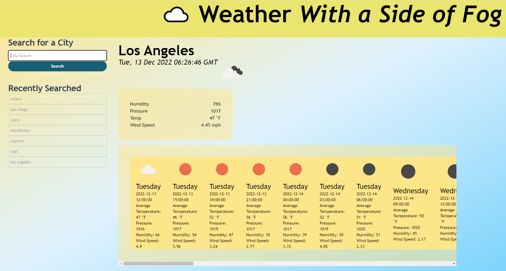

# wasof
With a side of fog

As a User: 
I want to see my current location weather data so I can plan my day
I want to see forcasted weather for the next 5 days so I can plan my week 

I want to search for other cities so I can plan trips or see how weather near my loved ones' homes will be

I want my search history to be logged so I can refer back to it for later use

When I search for a city, the data on the screen will auto update to show the weather forcast data for that city. 
That city is added to my list of recently searched cities.

When I click on a city I searched already, the data for that city will reload and replace the data on screen

When I review the forcasted data, I am able to scroll to view future days/times. 
Data is presented to me in increments of each 3 hours and is tagged accordingly. 

Deployed link: https://kabdomora.github.io/wasof/
Deployed screenshot: 